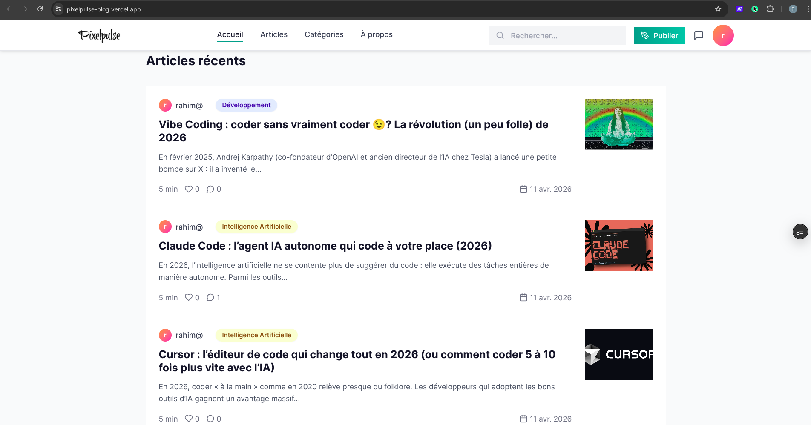

# PixelPulse - Blog Platform for Developers

PixelPulse is a modern and high-performance blog platform designed for developers, content creators, and technology enthusiasts. It offers a rich ecosystem for sharing knowledge, technology insights, and interacting with a growing community.

## 🌐 Live Demo

Visit the live version of the project on Vercel: [PixelPulse Live](https://pixelpulse-blog.vercel.app/)

## 🔥 Features

- **Article Publishing**: A rich text editor to create and publish your articles.
- **Category Management**: Organize your articles into categories for easy navigation.
- **Interactive Comments**: Engage with your readers through a commenting system.
- **Powerful Search**: Quickly find articles with efficient search functionality.
- **Author Profiles**: Showcase your biography and contributions.

## 🛠️ Tech Stack

- **Framework**: [Next.js](https://nextjs.org/)
- **Database**: [PostgreSQL](https://www.postgresql.org/) with [Prisma](https://www.prisma.io/)
- **Authentication**: [NextAuth.js](https://next-auth.js.org/)
- **Styling**: [Tailwind CSS](https://tailwindcss.com/)

---
